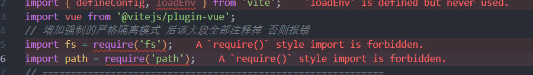

# DEMO1. Differences Between pnpm And npm

## In Git Bash, create two identical Vue projects with different package managers: npm and pnpm

### pnpm create vite my-vue-project --template vue


The displayed `node_modules` sizes of the pnpm and npm projects are almost the same because both Vue projects are currently empty, with few dependencies and small package size.

If you create `n` npm projects, disk usage becomes `n` times larger. In the same case, pnpm does not duplicate the same storage space.

## Query inode and node_modules directory content

Use:

```bash
ls -la node_modules/
```

## If Vue and pnpm are on the same system partition, their inode can be the same; otherwise it must be different

The same inode proves that it is a hard link rather than a copy, which saves a large amount of disk space.

---

# DEMO2. Vite Multi-Environment Configuration And Mode Runtime Verification

## `ls`: list directory content in the default concise mode

## `ls -la = ls -l -a`: combined parameters

### `-a` (`all`): show all files

It includes hidden files whose names start with `.`, such as `.bashrc` and `.git`, as well as the current directory `.` and parent directory `..`.

### `-l` (`long`): use long detailed listing format


## The same inode number in the screenshots proves hard linking

It proves that the files are hard links rather than copies, which greatly saves disk space.

### Entries starting with `lr...` are symbolic links

Entries starting with `-`, such as `-rw...`, are regular files and may be hard linked.

## Verify pnpm's strict isolation

If `lodash` is not declared as a dependency, pnpm will not install it.


## Variables without the `VITE_` prefix cannot be referenced directly on the client

When a variable does not belong to the current Vite environment exposure rules, referencing it in the page returns `undefined`.


## Modify `vite.config.js` And Why It Is Needed

Without modification, Vite uses default configuration:

1. Port `5173`
2. Does not automatically open the browser
3. Does not generate sourcemaps
4. Does not explicitly distinguish environment variable loading beyond default `development` and `production`

After modification, Vite behavior can be customized:

1. Change the port
2. Automatically open the browser
3. Generate sourcemaps
4. Conditionally configure according to `command` and `mode`
5. Configure proxy, aliases, plugins, and other options

After modification, the terminal output reflects these changes.


```js
import { defineConfig } from "vite";
import vue from "@vitejs/plugin-vue";
import fs from "fs";
import path from "path";

console.log("\n========== Vite config loaded (pnpm environment) ==========");
console.log("Current command:", process.argv[2]);
console.log("Current working directory:", process.cwd());

const pnpmDir = path.join(process.cwd(), "node_modules", ".pnpm");
if (fs.existsSync(pnpmDir)) {
  console.log("Detected pnpm .pnpm directory (strict isolation mode)");
  const items = fs.readdirSync(pnpmDir).slice(0, 6);
  console.log(".pnpm directory content (first 6):", items.join(", "));
} else {
  console.log("No .pnpm directory detected; this may not be a pnpm project");
}

const nodeModulesDir = path.join(process.cwd(), "node_modules");
const topLevelDeps = fs
  .readdirSync(nodeModulesDir)
  .filter((name) => !name.startsWith("."));
console.log("node_modules top-level dependencies:", topLevelDeps.join(", "));
console.log("==================================================\n");

export default defineConfig(({ command, mode }) => {
  console.log("defineConfig received command:", command);
  console.log("defineConfig received mode:", mode);
  console.log("Will load .env." + mode + " file");

  return {
    plugins: [vue()],
    server: {
      port: mode === "test" ? 3000 : 5173,
      open: true,
    },
    build: {
      sourcemap: true,
    },
  };
});
```

### Purpose Of The Added Code

`fs` and `path` are Node tools for path processing and local file reading. They are often used for path aliases and local certificate handling.

`process.argv[]` is a Node built-in array that records the full command used to start the process.

```text
pnpm dev   -> prints serve
pnpm build -> prints build
```

`process.cwd()` gets the folder where the command is executed, usually the project root.

## Core: detect whether it is a pnpm project

```js
const pnpmDir = path.join(process.cwd(), "node_modules", ".pnpm");
if (fs.existsSync(pnpmDir)) {
  const items = fs.readdirSync(pnpmDir).slice(0, 6);
  console.log("Detected pnpm .pnpm directory");
  console.log(".pnpm directory content:", items.join(","));
} else {
  console.log("No .pnpm directory detected");
}
```

After pnpm installs dependencies, `node_modules` contains a hidden `.pnpm` folder. Real dependency files are stored inside `.pnpm`, while the outside packages are links. npm does not have this `.pnpm` folder, so checking it can identify pnpm installation.

## Return The Final Vite Configuration Object

```js
return {
  plugins: [vue()],
};
```

## Development Server Configuration

This only takes effect during `pnpm dev`.

```js
server: {
  port: mode === 'test' ? 3000 : 5173,
  open: true,
}
```

## Build Configuration

This only takes effect during `pnpm build`.

`build.sourcemap: true` generates `.map` files, making it easier to locate source code during debugging and online error diagnosis.

## Verify Development Environment

```bash
pnpm dev
```


## Verify Custom Staging Environment

```bash
pnpm build -- --mode staging
```


## Verify Test/Production-Like Environment

```bash
pnpm build -- --mode test
pnpm preview
```


To switch back to development mode, run `pnpm dev`. This does not affect the build result. This is the core engineering idea of separating build and delivery.

---

# DEMO3. ESLint + Prettier + Husky + lint-staged Full Workflow Practice

Operate directly inside Demo2.

## Step 1: Install ESLint And Vue 3 Related Rules

```bash
pnpm add -D eslint eslint-plugin-vue @vue/eslint-config-typescript @typescript-eslint/eslint-plugin @typescript-eslint/parser
```

Package purposes:

```text
eslint: core JavaScript/TypeScript code checking library
eslint-plugin-vue: Vue 3-specific rules for .vue templates and scripts
@vue/eslint-config-typescript: official Vue TypeScript ESLint configuration
@typescript-eslint/parser: lets ESLint parse TypeScript syntax
@typescript-eslint/eslint-plugin: TypeScript-specific ESLint rules
```

### Install Prettier And Related Plugins

```bash
pnpm add -D prettier eslint-config-prettier eslint-plugin-prettier
```

```text
prettier: code formatter
eslint-config-prettier: disables ESLint rules that conflict with Prettier
eslint-plugin-prettier: runs Prettier as an ESLint rule
```

### Install Husky And lint-staged

```bash
pnpm add -D husky lint-staged
```

```text
husky: Git hooks management tool
lint-staged: checks only staged files
```

## Step 2: Configure ESLint CJS File

Example `.eslintrc.cjs`:

```cjs
module.exports = {
  root: true,
  env: {
    browser: true,
    node: true,
    es2021: true,
  },
  extends: [
    "eslint:recommended",
    "plugin:vue/vue3-recommended",
    "plugin:@typescript-eslint/recommended",
    "prettier",
  ],
  parser: "vue-eslint-parser",
  parserOptions: {
    parser: "@typescript-eslint/parser",
    ecmaVersion: "latest",
    sourceType: "module",
  },
  rules: {
    quotes: ["error", "single"],
    semi: ["error", "always"],
    indent: ["error", 2],
    "no-console": "off",
    "@typescript-eslint/no-unused-vars": ["error", { argsIgnorePattern: "^_" }],
    "vue/multi-word-component-names": "off",
  },
};
```

Why use CommonJS in an ES Module project? If the config file is named `.js`, Node may treat it as ESM and `module.exports` will error. Using `.cjs` forces CommonJS and keeps the config stable.

## Step 3: Create Prettier Configuration

Create `.prettierrc.cjs` in the project root:

```cjs
module.exports = {
  singleQuote: true,
  semi: true,
  tabWidth: 2,
  useTabs: false,
  printWidth: 100,
  trailingComma: "es5",
  bracketSpacing: true,
  arrowParens: "always",
  endOfLine: "auto",
};
```

## Step 4: Create Prettier Ignore File

Prettier skips the files and directories declared in `.prettierignore`.

```text
dist/
node_modules/
.log
.lock
.yaml
.yml
.html
.svg
```

In short, Prettier should only handle manually written business source code such as `ts`, `js`, `vue`, and `css`.

## Step 5: Add Scripts And lint-staged Configuration To package.json

Add commands under `scripts` and add a top-level `lint-staged` field:

```json
{
  "scripts": {
    "lint": "eslint . --ext .vue,.js,.ts --fix",
    "format": "prettier --write .",
    "lint:check": "eslint . --ext .vue,.js,.ts",
    "format:check": "prettier --check .",
    "prepare": "husky"
  }
}
```

```json
{
  "lint-staged": {
    "*.{js,ts,vue}": ["eslint --fix", "prettier --write"],
    "*.{css,scss}": ["prettier --write"],
    "*.{json,md}": ["prettier --write"]
  }
}
```

## Step 6: Initialize Husky

Run in Git Bash:

```bash
pnpm run prepare
```

The folder must be a Git repository; otherwise Husky cannot initialize.

Create the `pre-commit` hook:

```bash
npx husky hook add pre-commit "npx lint-staged"
```

Expected `.husky/pre-commit` content:

```sh
#!/bin/sh
. "$(dirname "$0")/_/husky.sh"

pnpm lint-staged
```

When `git commit` runs, Git executes this script first. It calls `pnpm lint-staged`, which only checks files that have been added to the Git staging area.

## Step 7: Verify Installation

```bash
pnpm lint
pnpm format
git add src/App.vue
pnpm lint-staged
```

If ESLint is too new and does not support the old `.eslintrc.cjs` format, use one of the following solutions.

### Solution 1: downgrade ESLint to 8.x

This is the simplest and most stable solution for the current `.eslintrc.cjs` configuration.

```bash
pnpm remove eslint eslint-plugin-vue @vue/eslint-config-typescript @typescript-eslint/eslint-plugin @typescript-eslint/parser
pnpm add -D eslint@8 eslint-plugin-vue @vue/eslint-config-typescript @typescript-eslint/eslint-plugin @typescript-eslint/parser
pnpm lint
```

### Solution 2: keep ESLint 9/10 and migrate to flat config

This requires renaming `.eslintrc.cjs` to `eslint.config.js`, rewriting the configuration to ESM `export default`, and adapting plugin imports. The change is large and not suitable for the current stage.

ESLint 9/10 is a breaking update that abandons the traditional `.eslintrc` format and enforces the new flat config format.

The lint command can be narrowed to source code:

```json
"lint": "eslint src --ext .vue,.js,.ts --fix"
```

This avoids scanning unrelated documents and generated files.

## Step 8: Intentionally Write Bad Code

For example, use double quotes or omit semicolons to verify the quality gate.

## Step 9: Commit Bad Code And Observe Interception

```bash
git add src/App.vue
git commit -m "test: intentionally commit bad code to verify ESLint blocking"
```

Husky should report errors and block the commit.

---

# DEMO4. Vite Code Splitting Strategy And Route Lazy Loading Verification

## Step 1: Create Three Pages

Create `Home`, `User`, and `Admin` pages in the existing project.

## Step 2: Install And Configure Router

Use `component: () => import('file path')` to implement route lazy loading.

## Step 3: Modify `src/main.ts` To Register Router

## Step 4: Modify `src/App.vue` To Display Router Outlet

Markdown uses triple backticks to prevent code from being parsed by the browser. Remember to include both opening and closing backticks.

## Step 5: Modify `vite.config.ts` For Code Splitting

Manual splitting puts Vue core libraries into a vendor package. In newer Rollup versions, the function form is required rather than object form.

Sourcemaps are not only for locating source code during debugging. When `sourcemap: true` is enabled, Vite generates `.map` files that map compressed code to original code.

The `[hash]` in chunk file names changes on every content change. If the hash changes, browsers reload the asset; if it does not change, browsers keep using the cache.

## Step 6: Verify All Scenarios

```bash
pnpm dev
pnpm build
pnpm preview
```

Route lazy loading means code for pages the user does not visit will not be loaded in advance.

`manualChunks` prevents repeated downloads. Vue core libraries are loaded only once and can be cached by the browser. Business code changes do not change the vendor hash.

The core goal of splitting is to minimize the JavaScript required for the first screen.

---

# DEMO5. Automated Code Generator Based On fs + inquirer

## Step 1: Install Dependencies

## Step 2: Create Script File

```ts
#!/usr/bin/env ts-node
```

## Step 3: Add Script Command To package.json

## Step 4: Create Required Directory Structure

## Step 6: Run The Script To Generate A Module

## Step 7: Verify Generated Files

## Step 8: Register Generated Route In Vue Router

## Step 9: Add Navigation Link On The Home Page

## Step 10: Verify The Complete Flow

The real value is that a large number of modules can be generated by running `pnpm gen` and entering module names. The script turns directory layering rules into an automated production line. New team members can generate the same structure on day one without memorizing conventions.

---

# DEMO6. GitHub Actions CI Pipeline

## Step 1: Install Vitest

## Step 2: Write A Simple Unit Test

## Step 3: Add Test Commands To package.json

## Step 4: Verify Tests Locally

## Step 5: Create GitHub Repository And Push Code

## Step 6: Create GitHub Actions Workflow

The workflow file must be placed in the root `.github/workflows` directory, otherwise GitHub cannot detect it.

## Step 7: Observe Pipeline Result

---

# DEMO7. Playwright End-To-End Testing

E2E testing writes a "robot" that opens the website like a real user, clicks, fills inputs, and verifies whether the page actually works.

Goal: use Playwright to open the browser, visit the home page, click the user page, and check whether the page is normal.

## Step 1: Install Playwright

## Step 2: Create E2E Test File

## Step 3: Add E2E Commands To package.json

## Step 4: Verify E2E Locally

Playwright needs the development server running. Open two terminals.

## Step 5: Add E2E To CI Pipeline

## Step 6: Commit, Push, And Observe Pipeline

---

# DEMO8. Performance Monitoring SDK

## Step 1: Create Performance Monitoring Script

## Step 2: Enable Performance Monitoring In main.ts

## Step 3: Verify With Lighthouse

If ESLint treats all `console` calls as errors, disable that rule temporarily so monitoring output can be observed.

---

# DEMO9. Automated Deployment Script

## Step 1: Create Deployment Script

```ts
#!/usr/bin/env ts-node
```

This shebang must be placed on the first line. It tells the operating system to use `ts-node` from the environment `PATH` to run the current `.ts` file.

## Step 2: Add Deployment Command To package.json

### deploy folder

### backup folder

`deploy` is the currently running site; `backups` is the time machine. Without buying a cloud server, the project still practices the core workflow of continuous delivery locally.

## Step 3: Verify

---

# DEMO10. Version Rollback Mechanism

Write a rollback script that lists all backup versions and lets you choose one to restore quickly, simulating second-level rollback after an online incident.

## Step 1: Create `scripts/rollback.ts`

```ts
#!/usr/bin/env ts-node
```

## Step 2: Add Rollback Command To package.json

## Step 3: Verify

Run `pnpm deploy` several times to create backup versions, then run:

```bash
pnpm rollback
```

---

# DEMO11. CDN Acceleration Simulation

CDN means Content Delivery Network. It caches static resources such as images, fonts, JavaScript, CSS, videos, and HTML on many edge nodes. Users access the nearest node instead of the distant origin server.

## Step 1: Modify `vite.config.ts` CDN Base Path

## Step 2: Build And Observe Output Paths

## Step 3: Use http-server To Simulate CDN

```bash
pnpm add -D http-server
```

## Step 4: Verify CDN Loading

## What CDN Does

### 1. Faster access speed

### 2. Handles high traffic and protects origin server

### 3. Improves cross-region access

### 4. Provides a degree of DDoS resistance

### 5. Saves origin bandwidth cost

Large downloads are served by the CDN provider, reducing origin bandwidth.

---

# DEMO12. Request Pool And Concurrency Control

Goal: simulate 100 API requests from one page while limiting concurrency to 6. Remaining requests wait in a queue to avoid browser overload.

## Step 1: Create Request Pool Utility

## Step 2: Simulate Concurrent Requests In A Vue Component

## Step 3: Verify

Without a request pool, 20 requests may be launched at once and fill all available browser connections, making the page slow.

---

# DEMO13. Exponential Backoff Retry

Limit the maximum retry count and avoid infinite loops.

## Step 1: Create Retry Utility

## Step 2: Create Test API That Simulates Failure

## Step 3: Add Test Button In App.vue

## Step 4: Verify

The output appears in the browser console, not in the visible page output area.

---

# DEMO14. Service Worker Offline Cache

Resources can still be loaded while offline.

## Step 1: Create Service Worker File

Create `sw.js` under the project root `demo2-env/`, not under `src/`.

## Step 2: Configure Vite To Copy sw.js To dist

Create `public/` and move `sw.js` into it. Vite copies files in `public/` directly to the root of `dist`.

## Step 3: Register Service Worker

## Step 4: Verify Offline Cache

Build, start the preview, visit once, then disconnect network and refresh.

Service Worker scripts must be JavaScript files with MIME type `text/javascript` or `application/javascript`. If written as TypeScript and served with the wrong MIME type, the browser will reject registration.

---

# DEMO15. Local Packet Capture Environment And HTTPS Decryption

## Daily Development Usage

## Step 1: Install Whistle

Whistle has flexible rule configuration, supports HTTP/HTTPS/WebSocket, and includes a web UI.

```bash
w2 start
```

The management UI is usually:

```text
http://127.0.0.1:8899
```

Whistle runs a proxy server on port `8899`. Use `w2 stop` to stop it and `w2 restart` to restart it.

## Step 2: Configure Browser Proxy

System proxy affects all apps, so switch it off after use. SwitchyOmega is convenient for quick switching.

## Step 3: Open Whistle Management UI

Remember this workflow: when debugging network issues, open Whistle, check Network logs, and write Rules when data needs to be changed.

## Step 4: Install Whistle Root Certificate

This is required for HTTPS decryption.

Restart Whistle after installation:

```bash
w2 restart
```

If HTTPS content is not visible, check browser proxy extension settings and certificate trust settings.

## Step 5: Configure Proxy Rules

Use rules to:

```text
Proxy online API requests to local dev service
Replace an online JS file with a local file
Mock API response data
Simulate slow network with 500ms delay
Inject CORS response headers
```

## Step 6: Verify Proxy

Add a request button in the project, create mock data in Whistle, configure intercept rules, and verify that the mock response works.

Always disable the proxy after use, otherwise other projects and websites may be affected.

Recommended workflow:

```text
Debugging: start Whistle -> enable system/browser proxy -> debug.
Finished: disable proxy -> stop Whistle.
```

---

# DEMO16. vConsole Debug Hook And SourceMap Configuration

## Step 1: Install vConsole

## Step 2: Dynamically Load Debug Hook In main.ts

## Step 3: Configure Vite To Generate SourceMap

## Step 4: Verify vConsole

---

# DEMO17. WebSocket Two-Way Communication

## Why This Demo Exists

Polling and long polling waste requests, consume server resources, and have poor real-time performance. HTTP is stateless request-response communication, so the server cannot actively push data to the client. This is why WebSocket exists.

## What This Demo Does

```text
Full-duplex real-time communication: client and server can send messages to each other independently.
Very low latency: messages arrive in milliseconds.
Low overhead: after connection establishment, messages use small frames without repeated HTTP headers.
Persistent connection: one handshake keeps the connection alive until failure or manual close.
```

## What To Learn

```text
Understand WebSocket concepts: full duplex, long connection, server push.
Master browser APIs: new WebSocket(), onopen, onmessage, onclose, send().
Compare HTTP polling, long polling, and WebSocket.
Debug frames in Chrome DevTools -> Network -> WS.
Build technical selection thinking for real-time communication.
```

## Step 1: Create WebSocket Test Component

## Step 2: Import WebSocketDemo In App.vue

## Step 3: Verify WebSocket

## Step 4: Observe The Long Connection

---

# DEMO18. Remote Log Retrieval System

Meaning: capture errors at key business points such as payment and login, store error information, user operation path, and device information in `localStorage`, and let users export logs with one click for diagnosis.

```text
src/types/logger.d.ts: log-related type definitions
src/utils/logger.ts: core log utility implementation
src/App.vue: demo page for simulated payment and log export
```

## Step 1: Type Definitions

File: `src/types/logger.d.ts`. Files with `.d.ts` are type declaration files and should not contain real runtime logic.

## Step 2: Log Utility Implementation

File: `src/utils/logger.ts`.

## Step 3: Demo Page

File: `src/App.vue`; additions are made while keeping original content.

---

# DEMO19. Hidden Online Debug Entry

## Core Features

```text
Click the logo 5 times continuously to dynamically load vConsole.
Suitable for emergency online debugging after user feedback, without releasing a new version.
If there is no continued click within 2 seconds, the count resets automatically.
```

## File Creation Order

1. Create `src/types/vconsole.d.ts`
2. Create `src/types/global.d.ts`
3. Create `src/composables/useVConsole.ts`
4. Create `src/components/LogoDebugTrigger.vue`
5. Integrate it in `src/App.vue`

Run:

```bash
pnpm add -D pnpm
pnpm dev
```

Verify Demo 19 in production mode because the automatic loading condition from Demo 16 usually does not trigger in production. The hidden entry works in that case.

---

# DEMO20. Use ChatGPT And d3.js To Draw A Project Knowledge Graph

## Step 1: Prepare Environment

## Step 2: Install Dependencies

## Step 3: Create Script File

## Step 4: Run Script

## Step 5: Get Output

---

# DEMO21. Major CI/CD GitHub Actions Modification

## 1. package.json

Potential impact: if all tests are under `src`, narrowing test scanning to `src` reduces accidental scanning. Do not add `src` only to make tests pass; confirm real test locations.

## 2. IProductParams And IProductResponse

Empty generic interfaces can cause ESLint errors. Use an index signature object type to avoid empty interface warnings, though the type is still weak and can be improved later.

## 3. defineProps In LogoDebugTrigger.vue

Compare the advantages of original and new writing styles.

## 4. defineEmits

Typed emits declare event names and parameter types. Removing parameter declarations weakens type checking.

## 5. Change product.ts Import To import type

`import type` is removed from compiled JavaScript, preventing types from being treated as runtime objects.

## 6. performanceReporter.ts Type Assertion

Use more specific types to improve type safety.

---

# DEMO22. GitHub Pages Continuous Deployment

## Add `deploy.yml` Under `.github/workflows`

## Trigger Method

## Deployment Flow

## First-Time Enablement

Enable GitHub Pages settings in the GitHub repository.

## Required Vite And Vue Router Configuration

### 1. Vite Pages Subpath

### 2. Vue Router Must Use BASE_URL

## Final Result

The project can be automatically deployed to GitHub Pages.

---

# DEMO23. Playwright E2E Implementation Modification

The real reason for the earlier error was that Playwright globally scanned all `.test.ts` files, including `utils/_test_/math.test.ts`, which is a Vitest file and should not be scanned by Playwright. Add a Playwright config to lock the test range to `e2e` and let it automatically start the Vite server.

## playwright.config.js

## Modify package.json

Run E2E tests with `playwright.config.js` explicitly so the new E2E config takes effect.

## Modify vite.config.js

## Modify homepage.spec.ts

Change full URLs to relative URLs.

If `pnpm dev` and `pnpm test:e2e` still fail, it may be because `App.vue` contains many static demo headings, so `page.locator('h1')` matches multiple `h1` elements. Playwright strict mode expects a unique element and fails.

`page.getByRole('heading')` is equivalent to matching headings such as `h1`.

Then import router in `router/index.ts` and import router in `main.js`, then run the E2E test again.

## Why E2E Does Not Appear In GitHub Actions

Because `.github/workflows/ci.yml` did not configure E2E test steps. After adding the related CI step, GitHub Actions can show E2E test traces.

## Recommended Online Release Check Order

CI/CD changes are related not only to code, but also package scripts, workflow files, environment variables, and deployment target configuration.

## How GitHub Pages Static Site Is Implemented

Through GitHub Actions CI/CD and GitHub Pages automatic deployment.

Flow:

```text
1. After the master branch updates, deploy.yml triggers CD deployment to GitHub Pages.
2. Actions enters Demo2/demo2-env, installs dependencies, and runs pnpm build.
3. VITE_BASE_PATH is injected as /Front-end-engineering/.
4. vite.config.js uses it as base so asset paths point to https://terrenceeeee.github.io/Front-end-engineering/.
5. dist is uploaded and published to Pages.
```

Key files:

- [.github/workflows/deploy.yml](./.github/workflows/deploy.yml)
- [Demo2/demo2-env/vite.config.js](./Demo2/demo2-env/vite.config.js)
- [Demo2/demo2-env/package.json](./Demo2/demo2-env/package.json)

## If A Minimized Web Page Forces Itself To Maximize Again

### 1. The page listens to `visibilitychange` or `blur` and repeatedly calls `window.focus()`

The browser usually does not directly maximize a window, but it may flash or bring it to the foreground, looking like it bounced back.

### 2. The page uses the HTML Fullscreen API `requestFullscreen()`

This is page fullscreen, not browser window maximization. If the page detects exiting fullscreen after minimization and requests fullscreen again, it can look like the window is forced back.

---

# Appendix: Detailed package.json Explanation

```json
{
  "name": "demo2-env",
  "private": true,
  "version": "0.0.0",
  "type": "module",
  "scripts": {
    "dev": "vite",
    "build": "vite build",
    "preview": "vite preview",
    "lint": "eslint src --ext .vue,.js,.ts --fix",
    "format": "prettier --write .",
    "lint:check": "eslint src --ext .vue,.js,.ts",
    "format:check": "prettier --check .",
    "prepare": "husky",
    "lint-staged": "lint-staged",
    "gen": "node scripts/generate.ts",
    "test": "vitest run src",
    "test:coverage": "vitest run --coverage",
    "test:e2e": "playwright test --config=playwright.config.js",
    "test:e2e:ui": "playwright test --ui",
    "deploy": "pnpm build && node scripts/deploy.ts",
    "rollback": "node scripts/rollback.ts",
    "serve:cdn": "http-server dist --port 8080 --cors"
  }
}
```

The scripts cover local development, build preview, linting, formatting, Git hook initialization, code generation, unit tests, E2E tests, deployment, rollback, and local static CDN simulation.

---

# DEMO24. Complete Standardization Supplement: ESLint Configuration Governance

## `.env` File Governance

`.env.development` contained a plaintext `DATABASE_PASSWORD=123456`. Even for a test password, it should not enter the repository. It should be moved to local files or CI Secrets, while `.env.example` keeps only variable names and safe sample values.

## `.eslintrc.cjs` Governance

```js
parserOptions: {
  parser: '@typescript-eslint/parser',
  ecmaVersion: 'latest',
  sourceType: 'module',
},
ignorePatterns: [
  'dist/',
  'dist-ssr/',
  'coverage/',
  'test-results/',
  'playwright-report/',
  'backups/',
  'deploy/',
  'node_modules/',
],
```

`ignorePatterns` tells ESLint not to check generated output, test reports, backup folders, deployment output, or dependencies.

## `.gitignore` Governance

```text
node_modules       # third-party dependencies
dist               # Vite build output
dist-ssr           # SSR build output
*.local            # local-only files

# Test and build artifacts
coverage
test-results
playwright-report

# Local deployment artifacts
backups
deploy

# Environment files with local secrets
.env.local
.env.*.local

# Editor directories and files
.vscode/*
```

## package.json Governance

Original:

```json
"lint:check": "eslint . --ext .vue,.js,.ts"
```

Changed to:

```json
"type-check": "tsc --noEmit",
"lint:check": "eslint src --ext .vue,.js,.ts"
```

`type-check` validates TypeScript types without generating artifacts. `lint:check` scans only source code.

## global.d.ts Governance

```ts
/// <reference types="vite/client" />
```

This imports Vite global type declarations so TypeScript recognizes `.vue` files, `import.meta.env`, and Vite-provided globals.

## performanceReporter.ts Governance

```ts
clsValue += entry.value ?? 0;
```

Some `LayoutShift` entries may have an undefined value. Using `?? 0` prevents `NaN` in performance reporting.

but now in the VSCODE is still this:


### If you want to solve this error and CI test and ESLint test exactly,you can add the following configuration in the the 'ignorePatterns' modules of .eslintrc.cjs

```js
'vite.config.ts',

```


and the problem is solved successfully

---

# DEMO25. Open Source Project Standardization: README And LICENSE

```md
# Project Name

> One sentence describing what the project is and what problem it solves.

[](https://github.com/your-repo/actions)
[](https://github.com/your-repo)
[](./LICENSE)

---

## Table Of Contents

- [Project Introduction](#project-introduction)
- [Tech Stack](#tech-stack)
- [Quick Start](#quick-start)
- [Core Features](#core-features)
- [Project Structure](#project-structure)
- [Development Guide](#development-guide)
- [Deployment](#deployment)
- [Contribution Guide](#contribution-guide)
- [License](#license)

---

## Project Introduction

Use 2-3 paragraphs to describe background, goals, and main features.

Example:
This project is an e-commerce checkout page demo built with **Vue 3 + TypeScript + Vite**, used to demonstrate front-end engineering best practices. It solves:

- Inconsistent code style in collaboration
- Cumbersome and error-prone deployment
- Difficult online issue diagnosis

---

## Tech Stack

| Area            | Technology                    |
| :-------------- | :---------------------------- |
| Framework       | Vue 3 + TypeScript            |
| Build Tool      | Vite                          |
| Package Manager | pnpm                          |
| Code Standards  | ESLint + Prettier + Husky     |
| Unit Testing    | Vitest + jsdom                |
| E2E Testing     | Playwright                    |
| CI/CD           | GitHub Actions + GitHub Pages |
```

## Quick Start

### Prerequisites

- Node.js >= 18
- pnpm >= 8

### Install And Run

```bash
git clone https://github.com/your-repo/project-name.git
cd project-name
pnpm install
pnpm dev
pnpm test
pnpm build
```

## Core Features

## Feature 1: xxx

**Problem solved:** ...

**How to use:** ...

**Core code:**

```ts
// Example code
```

## Feature 2: xxx

Use the same structure and list 3-5 core features.

---

## Project Structure

```text
project-name/
├── .github/
│   └── workflows/
│       ├── ci.yml
│       └── deploy.yml
├── src/
│   ├── components/
│   ├── composables/
│   ├── pages/
│   ├── utils/
│   └── main.ts
├── scripts/
├── tests/
├── package.json
├── vite.config.ts
└── README.md
```

## Development Guide

## Code Standards

```bash
pnpm lint
pnpm format
```

## Commit Convention

```text
feat: new feature
fix: bug fix
docs: documentation update
style: code formatting
refactor: refactoring
test: testing
chore: build/tooling configuration
```

## Deployment

Automatic deployment uses GitHub Actions:

```text
CI: after push, automatically runs lint -> test -> build; failure blocks merging.
CD: after CI passes, automatically builds and publishes to GitHub Pages.
```

Manual deployment:

```bash
pnpm deploy
pnpm rollback
```

## Contribution Guide

```text
1. Fork this repository.
2. Create a feature branch: git checkout -b feat/xxx
3. Commit code: git commit -m "feat: xxx"
4. Push the branch: git push origin feat/xxx
5. Submit a Pull Request.
```

## License

```text
MIT (c) 2026 [Your Name]
```

## How To Create LICENSE

Create a file named `LICENSE` in the GitHub repository and add:

```text
MIT License

Copyright (c) 2026 your GitHub name

Permission is hereby granted, free of charge, to any person obtaining a copy
of this software and associated documentation files (the "Software"), to deal
in the Software without restriction, including without limitation the rights
to use, copy, modify, merge, publish, distribute, sublicense, and/or sell
copies of the Software, and to permit persons to whom the Software is
furnished to do so, subject to the following conditions:

The above copyright notice and this permission notice shall be included in all
copies or substantial portions of the Software.

THE SOFTWARE IS PROVIDED "AS IS", WITHOUT WARRANTY OF ANY KIND, EXPRESS OR
IMPLIED, INCLUDING BUT NOT LIMITED TO THE WARRANTIES OF MERCHANTABILITY,
FITNESS FOR A PARTICULAR PURPOSE AND NONINFRINGEMENT. IN NO EVENT SHALL THE
AUTHORS OR COPYRIGHT HOLDERS BE LIABLE FOR ANY CLAIM, DAMAGES OR OTHER
LIABILITY, WHETHER IN AN ACTION OF CONTRACT, TORT OR OTHERWISE, ARISING FROM,
OUT OF OR IN CONNECTION WITH THE SOFTWARE OR THE USE OR OTHER DEALINGS IN THE
SOFTWARE.
```

Finally, add this to the end of README:

```text
# License
MIT (c) 2026 Terrenceeeee
```

---

# Supplementary for Standardized Open‑Source Project: DEMO26 — Improvements and Additions for Prettier Execution and CI/CD

## 1. Two approaches to enable Prettier

### Approach 1: Run via bash terminal (for local development & testing)

```
# Check: Only verify formatting without modifying files. Returns exit code 1 in CI if formatting rules are violated
pnpm prettier --check .

# Rewrite and format all files directly
pnpm prettier --write .
```

### Approach 2: Auto‑format on save (widely‑used, mandatory for engineering workflows)

Configure in `.vscode/settings.json`

```
{
  "editor.defaultFormatter": "esbenp.prettier-vscode",
  "editor.formatOnSave": true
}
```

Prettier will run automatically the moment you save a file, no manual commands required.

## 2. Add and refine CI/CD capabilities, adjust CI scope for stricter enforcement

### Main Objectives

- Make CI act as a genuine quality gate
- Clarify responsibilities for test workflows
- Keep consistent code style for future incoming code changes

### Additional CI checks: type‑check, format check, coverage test

```
type‑check in CI: Catches TypeScript type errors early instead of discovering them only during build time
format:check in CI: Enforces unified code style and reduces style‑related noise among team members
test:coverage working properly: Confirms coverage pipeline is ready for gradually raising test coverage for critical code
```

```
- name: Type Check
  run: pnpm type‑check

- name: Format Check
  run: pnpm format:check

- name: Coverage Test
  run: pnpm test:coverage
```

## 3. Adjust Vitest test scope

Inside `package.json`, change:

```
"test": "vitest run src",
```

to:

```
"test": "vitest run",
```

> This enables Vitest to scan the entire project instead of only the `src` directory.
> Previously, some outer‑directory checks failed due to ESLint / Prettier violations. After fixing ESLint configurations, full‑project testing can execute successfully.

> Important note: E2E test files may be mistakenly picked up by Vitest.
> In `vitest.config.ts`, use `test.include` / `test.exclude` to explicitly exclude E2E directories and prevent E2E cases from being treated as unit tests.

```
        chunkFileNames: 'assets/[name]-[hash].js',
      },
    },
  },
  test: {
    include: ['src/**/*.test.{ts,js}', 'src/**/*.spec.{ts,js}'],
    exclude: ['e2e/**', 'node_modules/**', 'dist/**'],
  },
```

This configuration prevents Vitest from processing E2E test files.

## 4. Auto‑generated `test‑results/last‑run.json` for CI/CD reporting

Stores status from the most recent E2E test run, for example:
‑ Whether the test suite passed
‑ List of failed test cases

# Appendix: Git Commit Message Specification

## 1. Type (Required)

```
feat: New feature
fix: Bug fixes
docs: Documentation updates, markdown & comment changes
style: Code‑formatting adjustments with no changes to business logic
refactor: Code refactoring (neither new feature nor bug fix)
test: Test‑related changes: add or update unit tests, E2E tests
chore: Build / tooling configurations, scaffolding, miscellaneous chores, version bumps, no modifications to src business code
perf: Performance optimization and performance‑related adjustments
build: Build process, build tools, external dependencies, CI, pnpm, vite configurations
ci: CI‑related changes for GitHub Actions / GitLab CI pipelines
```

## 2. Scope (Optional)

Specify the target module or file.

Examples: `vite‑config`, `request‑pool`, `task`, `eslint`, `ci`

```text
feat(task): add task priority filtering
fix(request‑pool): fix overflow issue in request concurrency queue
ci: adjust eslint scanning scope
build(vite‑config): modify alias configuration
```

## 3. Subject (Short description, required)

Keep it within 50 characters, start with a verb, use lowercase, **do not end with a period**.

✅ Good examples:

```text
fix: fix counter error in request pool
feat(task): add task sorting field
ci: enable strict eslint validation
```

## 4. Body (Optional, for complex commits only)

Leave one blank line before the body.
Explain **why this change is made, background context and impacts**. Wrap lines at 72 characters.
Use this for large refactors or breaking‑change commits.

## 5. BREAKING CHANGE (For breaking modifications)

Mandatory when API / configuration changes break existing project compatibility:

```text
feat(user): modify return fields of user API

BREAKING CHANGE: The return structure of user API has changed. Existing code requires adapt
```

---

## Appendix: Markdown Code Fence Language Suffixes

````text
```js       // JavaScript
```json     // JSON
```html     // HTML
```css      // CSS
```vue      // Vue single-file component
```bash     // shell command
```sh       // almost equivalent to bash
```python   // Python
```go       // Go
```sql      // SQL
```yaml     // YAML configuration
```md       // Markdown code
````
